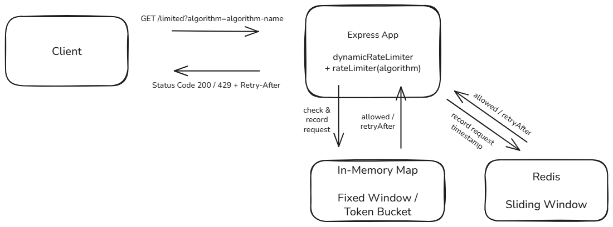

# Rate Limiter Backend

## What is Rate Limiting?

Rate limiting is a technique used to control the number of requests a client can make to a server within a specific time frame. It helps prevent abuse, protects APIs from overload, and ensures fair usage among clients.

## Project Overview

This project implements a backend API rate limiter using different algorithms. It allows developers to limit repeated requests from the same IP address to specific routes, thereby preventing misuse and ensuring system stability. It is written in Node.js using Express, and includes both in-memory and Redis-based algorithms along with comprehensive test coverage.

## Architecture



## Features

- Middleware-based integration for Express.js routes
- Multiple rate limiting algorithms, selectable per-request via a query parameter
- Redis support for distributed rate limiting
- Easy to configure window size and request limits
- Includes both unit and E2E test suites
- Built-in Retry-After headers for API clients
- IP-based request tracking with optional X-Forwarded-For support
- Interactive API documentation via Swagger UI
- Dockerized for local deployment via Docker Compose

## Technologies Used

- Node.js
- Express.js
- Redis
- Jest (unit testing)
- Supertest (E2E testing)
- dotenv (for environment variable management)
- Swagger UI / swagger-jsdoc (API documentation)
- Docker / Docker Compose

## Available Rate Limiting Algorithms

- Fixed Window Counter (in-memory)
- Token Bucket (in-memory with refill interval)
- Sliding Window Log (Redis-backed)

The algorithm is selected per-request via the `algorithm` query parameter on the `/limited` route:

```bash
curl "http://localhost:3000/limited?algorithm=fixed-window"
curl "http://localhost:3000/limited?algorithm=token-bucket"
curl "http://localhost:3000/limited?algorithm=sliding-window"
curl "http://localhost:3000/limited"  # defaults to fixed-window
```

## Project Structure

```
rate-limiter-backend/
├── .github/workflows/
│   └── ci-test.yml
├── docs/
│   ├── architecture.png
│   └── rate-limiting.md
├── src/
│   ├── middleware/
│   │   └── rateLimiter.js
│   ├── redis/
│   │   ├── client.js
│   │   └── helper.js
│   ├── tests/
│   │   ├── fixedWindow.e2e.test.js
│   │   ├── fixedWindow.test.js
│   │   ├── slidingWindow.e2e.test.js
│   │   ├── slidingWindow.test.js
│   │   ├── tokenBucket.e2e.test.js
│   │   └── tokenBucket.test.js
│   ├── app.js
│   └── server.js
├── .dockerignore
├── .env
├── .gitignore
├── docker-compose.yml
├── Dockerfile
├── jest.config.js
├── package-lock.json
├── package.json
├── swagger.js
└── README.md
```

## Environment Variables

Create a `.env` file in the root directory with the following variables:

```
PORT=3000
REDIS_HOST=127.0.0.1
REDIS_PORT=6379
```

## Running with Docker

The app and Redis can be run together locally with Docker Compose:

```bash
docker compose up --build
```

This builds the app image, starts Redis, and waits for Redis to report healthy before starting the app. The server will be available at `http://localhost:3000`.

The Dockerfile is multi-stage, with separate `development` and `production` targets — `development` includes dev dependencies (`jest`, `supertest`) for running tests inside the container if needed, while `production` excludes them for a smaller image. `docker-compose.yml` builds the `development` target by default. To build the production image directly instead:

```bash
docker build --target production -t rate-limiter-backend .
```

## API Documentation

Once the server is running, interactive API documentation (Swagger UI) is available at:

```
http://localhost:3000/api-docs
```

## Running Tests

Run the full test suite (unit and E2E, across all three algorithms) with:

```bash
npm run test
```

To run tests for a single algorithm instead:

```bash
npm run test:fixed    # Runs Fixed Window unit and E2E tests
npm run test:token    # Runs Token Bucket unit and E2E tests
npm run test:sliding  # Runs Sliding Window unit and E2E tests
```

Unit tests cover the core logic of individual algorithm functions directly.
End-to-End tests validate the behavior of the full Express app, using Supertest, selecting the algorithm via the `?algorithm=` query parameter.